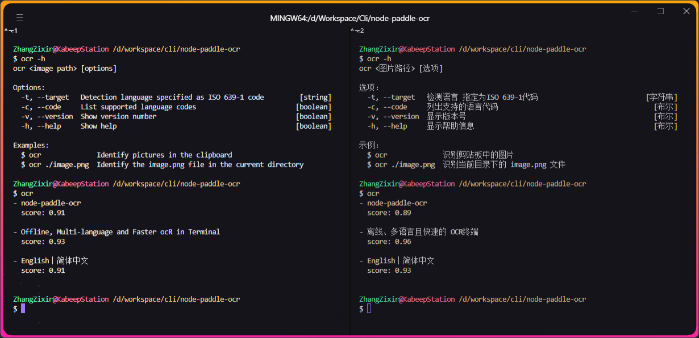

<div align="center">

# node-paddle-ocr

Offline, Multi-language and Faster **OCR** in Terminal.

---

English | [简体中文](README.zh-CN.md)



</div>

## 📖 Introduction

> An OCR terminal tool based on the open-source offline components of `PaddleOCR v2.6 C++`.

## ⚙️ Installation

1. Clone this repo
2. Run `cd node-paddle-ocr`
3. Run `npm run build`
4. Run `npm link`

## 🚀 Usage

```text
ocr <image path> [options]

Options:
  -t, --target   Detection language specified as ISO 639-1 code         [string]
  -c, --code     List supported language codes                         [boolean]
  -v, --version  Show version number                                   [boolean]
  -h, --help     Show help                                             [boolean]

Examples:
  $ ocr              Identify pictures in the clipboard
  $ ocr ./image.png  Identify the image.png file in the current directory
```

## ⚠️ Compatibility

- The system supports `Win10/11 x64`.
- It **is not recommended** to use `Win7` as the recognition engine is highly likely to be unable to run.
- The CPU must have the `AVX instruction set`. Common home-use CPUs generally meet this condition.

| AVX   | Supported product series                                                  | Not supported                        |
|-------|---------------------------------------------------------------------------|--------------------------------------|
| Intel | 	Core series, Xeon series                                                 | Atom, Itanium, Celeron, Pentium      |
| AMD   | Products after the Bulldozer architecture such as Ryzen, Athlon, FX, etc. | Products before the K10 architecture |

## 🔗 Related

- [PaddleOCR-json](https://github.com/hiroi-sora/PaddleOCR-json) -
  An OCR offline image text recognition command-line Windows program that outputs results in the form of JSON strings
  for convenient invocation by other programs. It provides APIs in various languages. Compiled by PaddleOCR C++.
- [PaddleOCR-json-node-api](https://github.com/PunchlY/PaddleOCR-json-node-api) - A node.js API based
  on PaddleOCR-json.

## 🤝 Contribution

Contributions via Pull Requests or [Issues](https://github.com/kabeep/node-paddle-ocr/issues) are welcome.

## 📄 License

This project is licensed under the MIT License. See the [LICENSE](LICENSE) file for details.