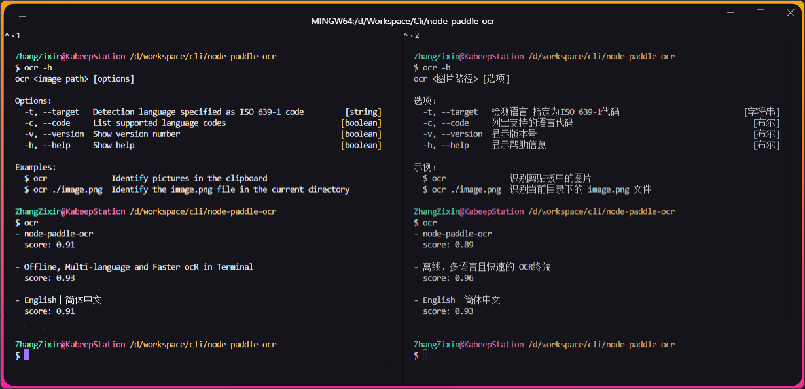

<div align="center">

# node-paddle-ocr

离线、多语言且快速的 **OCR** 终端。

---

[English](README.md) | 简体中文



</div>

## 📖 简介

> 基于 `PaddleOCR v2.6 C++` 开源离线组件的 OCR 终端工具。

## ⚙️ 安装

1. 克隆本仓库
2. 运行 `cd node-paddle-ocr`
3. 运行 `npm run build`
4. 运行 `npm link`

## 🚀 使用

```text
ocr <图片路径> [选项]

选项：
  -t, --target   检测语言 指定为ISO 639-1代码                           [字符串]
  -c, --code     列出支持的语言代码                                       [布尔]
  -v, --version  显示版本号                                               [布尔]
  -h, --help     显示帮助信息                                             [布尔]

示例：
  $ ocr              识别剪贴板中的图片
  $ ocr ./image.png  识别当前目录下的 image.png 文件
```

## ⚠️ 兼容性

- 系统支持 Win10/11 x64。
- 不建议使用 Win7，识别引擎很可能无法运行。
- CPU 必须具有 AVX 指令集。常见的家用 CPU 一般都满足该条件。

| AVX   | 支持的产品系列                            | 不支持                                  |
|-------|------------------------------------|--------------------------------------|
| Intel | 酷睿Core，至强Xeon                      | 凌动Atom，安腾Itanium，赛扬Celeron，奔腾Pentium |
| AMD   | 推土机架构及之后的产品，如锐龙Ryzen、速龙Athlon、FX 等 | K10架构及之前的产品                          |

## 🔗 关联项目

- [PaddleOCR-json](https://github.com/hiroi-sora/PaddleOCR-json) -
  OCR离线图片文字识别命令行windows程序，以JSON字符串形式输出结果，方便别的程序调用。提供各种语言API。由 PaddleOCR C++ 编译。
- [PaddleOCR-json-node-api](https://github.com/PunchlY/PaddleOCR-json-node-api) - 基于https:
  //github.com/hiroi-sora/PaddleOCR-json 的node.js api.

## 🤝 贡献

欢迎通过 Pull Requests 或 [Issues](https://github.com/kabeep/node-paddle-ocr/issues) 来贡献你的想法和代码。

## 📄 许可

本项目采用 MIT 许可证。详情请见 [LICENSE](LICENSE) 文件。